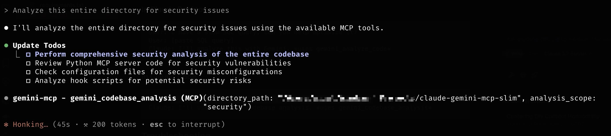

# Gemini MCP Server Setup Guide

This project creates a bridge between Claude Code and Google's Gemini AI models, giving you access to Gemini's powerful 1M+ token context window and latest AI capabilities directly within your Claude Code development environment.

## Prerequisites

Before you start, make sure you have:

1. **Python 3.8+** installed
2. **Node.js 16+** installed
3. **Gemini API Key** from Google AI Studio
4. **Gemini CLI** installed and authenticated:
   ```bash
   npm install -g @google/gemini-cli
   gemini  # Run this to authenticate with Google
   ```

## Quick Setup (5 minutes)

### Step 1: Create Shared MCP Environment

Create a dedicated system-wide location for all your MCP servers:

```bash
# Create shared MCP directory
mkdir -p ~/mcp-servers
cd ~/mcp-servers

# Create virtual environment for all MCP servers
python3 -m venv shared-mcp-env
source shared-mcp-env/bin/activate

# Install MCP dependencies
pip install mcp google-generativeai python-dotenv
```

### Step 2: Set Up Gemini MCP Server

Create the complete Gemini MCP package:

```bash
# Create Gemini MCP folder structure
mkdir -p gemini-mcp/.claude/scripts

# Download files from this repository to gemini-mcp/:
cp /path/to/downloaded/gemini_mcp_server.py gemini-mcp/
cp /path/to/downloaded/.claude/hooks.json gemini-mcp/.claude/
cp /path/to/downloaded/.claude/slash-commands.json gemini-mcp/.claude/
cp /path/to/downloaded/.claude/README-SLASH-COMMANDS.md gemini-mcp/.claude/
cp /path/to/downloaded/.claude/scripts/slim_gemini_hook.py gemini-mcp/.claude/scripts/
cp /path/to/downloaded/.claude/scripts/slash_commands.py gemini-mcp/.claude/scripts/

# Make scripts executable
chmod +x gemini-mcp/.claude/scripts/slim_gemini_hook.py
chmod +x gemini-mcp/.claude/scripts/slash_commands.py
```

**Why this architecture?**
- ✅ **One installation** serves all AI clients and projects
- ✅ **No project pollution** - keeps your projects clean
- ✅ **Easy maintenance** - update once, benefits everywhere
- ✅ **Professional deployment** - industry standard practice

### Step 3: Configure AI Clients

Configure your AI clients to use the shared Gemini MCP server:

#### For Claude Desktop

**Location:** `~/.config/claude-desktop/claude_desktop_config.json` (macOS/Linux) or `%APPDATA%\Claude\claude_desktop_config.json` (Windows)

```json
{
  "mcpServers": {
    "gemini-mcp": {
      "command": "/Users/YOUR_USERNAME/mcp-servers/shared-mcp-env/bin/python",
      "args": ["/Users/YOUR_USERNAME/mcp-servers/gemini-mcp/gemini_mcp_server.py"],
      "env": {
        "GOOGLE_API_KEY": "your_api_key_here",
        "GEMINI_FLASH_MODEL": "gemini-2.5-flash",
        "GEMINI_PRO_MODEL": "gemini-2.5-pro"
      }
    }
  }
}
```

#### For Claude Code (and Other MCP Clients)

**Location:** Project-specific or global MCP configuration

```json
{
  "mcpServers": {
    "gemini-mcp": {
      "command": "/Users/YOUR_USERNAME/mcp-servers/shared-mcp-env/bin/python",
      "args": ["/Users/YOUR_USERNAME/mcp-servers/gemini-mcp/gemini_mcp_server.py"],
      "env": {
        "GOOGLE_API_KEY": "your_api_key_here",
        "GEMINI_FLASH_MODEL": "gemini-2.5-flash",
        "GEMINI_PRO_MODEL": "gemini-2.5-pro"
      }
    }
  }
}
```

**Important:** Replace `YOUR_USERNAME` with your actual username and `your_api_key_here` with your Google API key.

### Step 4: Enable Hooks for Projects (Optional - Claude Code Ecosystem Only)

Hooks require a `.claude/hooks.json` file in your project directory. You have three options:

#### **Option A: Symlink to Shared Hooks (Recommended)**

**Best for:** Teams, multiple projects, easy maintenance

```bash
cd /path/to/your-project
ln -s ~/mcp-servers/gemini-mcp/.claude .claude
```

**Benefits:**
- ✅ **Easy updates** - modify shared hooks once, all projects benefit
- ✅ **Consistency** - all projects use identical hook logic
- ✅ **Quick setup** - one command per project
- ✅ **Version control friendly** - symlinks can be committed
- ✅ **20+ slash commands** - Instant access to shortcuts like `/g`, `/analyze`, `/security`

#### **Option B: Copy Hook Files Directly**

**Best for:** Project-specific customization, offline work

```bash
cd /path/to/your-project
mkdir -p .claude/scripts
cp ~/mcp-servers/gemini-mcp/.claude/hooks.json .claude/
cp ~/mcp-servers/gemini-mcp/.claude/slash-commands.json .claude/
cp ~/mcp-servers/gemini-mcp/.claude/README-SLASH-COMMANDS.md .claude/
cp ~/mcp-servers/gemini-mcp/.claude/scripts/slim_gemini_hook.py .claude/scripts/
cp ~/mcp-servers/gemini-mcp/.claude/scripts/slash_commands.py .claude/scripts/
```

**Benefits:**
- ✅ **Independent customization** - modify hooks per project
- ✅ **No dependencies** - works without shared MCP location
- ✅ **Full control** - each project owns its hook configuration

#### **Option C: No Hooks**

**Best for:** Simple workflows, non-Claude Code clients

```bash
# Do nothing - no .claude folder needed
# MCP tools still work perfectly
```

**Benefits:**
- ✅ **Clean projects** - no extra configuration files
- ✅ **Universal compatibility** - works with all MCP clients
- ✅ **Zero maintenance** - no hook files to manage

**What hooks enable (Claude Code ecosystem only):**
- 🔄 **Pre-edit analysis** - AI reviews code before making changes
- 🔍 **Pre-commit reviews** - AI checks changes before git commits
- 📋 **Session summaries** - AI provides session recaps
- ⚡ **20+ slash commands** - Quick shortcuts like `/g`, `/analyze`, `/security`

**Important:** Hook functionality **only works in Claude Code ecosystem** (Claude Code standalone or VS Code with Claude Code extension). All other clients (Cursor, Windsurf, Claude Desktop, VS Code with other extensions) ignore the `.claude` folder but still get all core MCP tools.

#### **Which Option Should You Choose?**

| Scenario | Recommended Option | Why |
|----------|-------------------|-----|
| **Multiple projects, team work** | Option A (Symlink) | Easy updates, consistency across projects |
| **Single project, custom needs** | Option B (Direct copy) | Full control, project-specific tweaks |
| **Using Cursor/Windsurf/Claude Desktop** | Option C (No hooks) | Hooks won't work anyway, keep it clean |
| **New to Claude Code** | Option C (No hooks) | Start simple, add hooks later if needed |
| **Experimenting/testing** | Option A (Symlink) | Easy to remove/modify |
| **Production deployment** | Option B (Direct copy) | No external dependencies |

### Step 5: Test the Setup

1. **Restart all AI clients** (Claude Desktop, Claude Code, Windsurf)
2. **Test Gemini CLI directly:**

   ```bash
   gemini -p "Hello, test connection"
   ```

   You should get a response from Gemini.

3. **Test in AI clients:**
   - Look for "gemini-mcp" in available tools
   - Try asking: "Use gemini_quick_query to ask what is 2+2"

## Standalone Helper CLI

### `gemini_helper.py`
- **Purpose:** A standalone CLI tool for direct Gemini interaction
- **Commands:**
  - **query**: Ask quick development questions
    - **Usage**: `python gemini_helper.py query "What's the difference between async and defer in JavaScript?"`
  - **analyze**: Analyze code files for security or performance
    - **Usage**: `python gemini_helper.py analyze my_file.py security`
  - **codebase**: Analyze entire codebases for architectural insights
    - **Usage**: `python gemini_helper.py codebase ./src performance`
- **When to use:**
  - Without a full MCP setup
  - When needing quick insights directly from the command line

## Available Tools

Once set up, you'll have access to these tools in both Claude Desktop and Claude Code:

### 🔍 `gemini_quick_query`

- **Purpose:** Ask Gemini CLI any quick question
- **Example:** "What's the best way to handle async errors in JavaScript?"
- **When to use:** Quick coding questions, explanations, general help

### 🔬 `gemini_analyze_code`

- **Purpose:** Analyze specific code sections with detailed insights
- **Example:** Analyze a function for security issues or performance
- **When to use:** Before making changes, code reviews, debugging

### 📊 `gemini_codebase_analysis`

- **Purpose:** Analyze entire directories using Gemini's 1M token context
- **Example:** Review whole project architecture, find patterns
- **When to use:** Project planning, refactoring, architecture reviews

## Usage Examples

### In Claude Desktop

```
User: I have a slow SQL query, can you help optimize it?
User: [paste SQL query]
Claude: I'll analyze this with Gemini. *uses gemini_analyze_code*
```

### In Claude Code

```
User: Analyze this entire src/ directory for security issues
Claude: I'll use Gemini's codebase analysis. *uses gemini_codebase_analysis*
```


## Troubleshooting

### "Server not found" or "Connection failed"

- ✅ Check that the file path in your MCP config is correct
- ✅ Restart Claude Desktop/Code after config changes
- ✅ Test that `python3 /path/to/gemini_mcp_server.py` runs without errors

### "Gemini authentication failed"

```bash
# Re-authenticate with Gemini CLI
gemini
```

### "No tools available"

- ✅ Check that `pip install mcp python-dotenv` was successful
- ✅ Verify your MCP config JSON syntax is valid
- ✅ Check Claude Desktop/Code logs for error messages

### "Module not found" errors

```bash
# Make sure you have the right Python environment
pip list | grep mcp
# Should show: mcp, python-dotenv
```

## File Structure

After setup, your structure should look like:

### Shared MCP Structure:

```
~/mcp-servers/                              ← Central location for all MCP servers
├── shared-mcp-env/                         ← Shared virtual environment
│   ├── bin/python                         ← Python interpreter for all MCPs
│   └── lib/python3.x/site-packages/       ← Shared dependencies (mcp, google-generativeai, etc.)
└── gemini-mcp/                             ← Complete Gemini MCP package
    ├── gemini_mcp_server.py                ← Main MCP server
    └── .claude/                            ← Complete slash commands system
        ├── hooks.json                      ← Hook definitions
        ├── slash-commands.json             ← 20+ slash command configurations
        ├── README-SLASH-COMMANDS.md        ← Slash commands documentation
        └── scripts/
            ├── slim_gemini_hook.py         ← Hook execution script
            └── slash_commands.py           ← Slash commands implementation
```

### Project Structure (with hooks enabled):

```
your-project/
├── .claude → ~/mcp-servers/gemini-mcp/.claude  ← Symlink to shared hooks
├── src/                                    ← Your project files
├── README.md
└── (no venv or MCP files needed!)           ← Clean project structure
```

**Benefits:**
- ✅ **System-wide availability** - All AI clients can access Gemini MCP
- ✅ **Clean projects** - No MCP dependencies polluting your project folders
- ✅ **Easy maintenance** - Update hooks/server once, benefits all projects
- ✅ **Selective hooks** - Only projects with symlinks get hook functionality

## Advanced Configuration

### Multiple MCP Servers

You can add more MCP servers to the shared environment:

```bash
cd ~/mcp-servers
source shared-mcp-env/bin/activate

# Install additional MCP servers
pip install other-mcp-server

# Create folders for each MCP
mkdir -p other-mcp-server/
```

### Updating the Gemini MCP

To update the Gemini MCP server:

```bash
cd ~/mcp-servers/gemini-mcp
# Replace files with updated versions
cp /path/to/new/gemini_mcp_server.py .
cp /path/to/new/.claude/hooks.json .claude/
# All projects automatically get the updates!
```

### Advanced Configuration Parameters

You can customize behavior by adding environment variables to your MCP config:

#### File Analysis Limits

**Default Values:**
- Maximum file size: 80KB (81,920 bytes)
- Maximum lines: 800 lines
- Response limit: 800 words (200 for session summaries)

**When to adjust:**
- **Larger files**: Increase limits for projects with big source files
- **Performance**: Decrease limits on slower systems or to save tokens
- **Detailed analysis**: Increase response limits for more comprehensive reviews

```json
{
  "mcpServers": {
    "gemini-mcp": {
      "command": "/Users/YOUR_USERNAME/mcp-servers/shared-mcp-env/bin/python",
      "args": ["/Users/YOUR_USERNAME/mcp-servers/gemini-mcp/gemini_mcp_server.py"],
      "env": {
        "MAX_FILE_SIZE": "120000",      // 120KB for larger files
        "MAX_FILE_LINES": "1000",       // 1000 lines for bigger files
        "MAX_RESPONSE_WORDS": "1000"    // More detailed analysis
      }
    }
  }
}
```

#### Timeout Settings

**Default Values:**
- Session summary: 30 seconds
- Code analysis: 60 seconds
- Codebase analysis: 120 seconds

**When to adjust:**
- **Slow network**: Increase timeouts for unstable connections
- **Large projects**: Increase for comprehensive codebase analysis
- **Quick feedback**: Decrease for faster responses

```json
{
  "env": {
    "ANALYSIS_TIMEOUT": "90",         // 90 seconds for code analysis
    "CODEBASE_TIMEOUT": "180",        // 3 minutes for full codebase
    "SESSION_TIMEOUT": "45"           // 45 seconds for summaries
  }
}
```

#### Model Selection & Performance

**Default Models:**
- Quick queries: `gemini-2.5-flash` (fast, cost-effective)
- Code analysis: `gemini-2.5-pro` (deep analysis)
- Codebase analysis: `gemini-2.5-pro` (large context)

**When to customize:**
- **Cost optimization**: Use Flash for all operations
- **Maximum quality**: Use Pro for all operations
- **Beta testing**: Try experimental models

```json
{
  "env": {
    "GEMINI_FLASH_MODEL": "gemini-2.5-flash-exp",  // Experimental Flash
    "GEMINI_PRO_MODEL": "gemini-2.5-pro-exp",      // Experimental Pro
    "FORCE_MODEL": "flash",                         // Force all operations to use Flash
    "GOOGLE_API_KEY": "your_api_key_here"           // Required for API access
  }
}
```

#### Hook Configuration (If Using Automation)

**Default Behavior:**
- Pre-edit analysis: Files under 800 lines, 80KB
- Pre-commit review: All staged changes
- Session summary: 200-word brief recap

**Customization options:**

```json
{
  "env": {
    "HOOK_FILE_LIMIT": "1000",        // Analyze files up to 1000 lines
    "HOOK_SIZE_LIMIT": "100000",      // Analyze files up to 100KB
    "HOOK_SUMMARY_WORDS": "300",      // 300-word session summaries
    "HOOK_ANALYSIS_WORDS": "1000",    // 1000-word pre-edit analysis
    "DISABLE_PRE_EDIT": "false",      // Set to "true" to disable pre-edit analysis
    "DISABLE_PRE_COMMIT": "false"     // Set to "true" to disable commit reviews
  }
}
```

#### Complete Configuration Example

```json
{
  "mcpServers": {
    "gemini-mcp": {
      "command": "/Users/YOUR_USERNAME/mcp-servers/shared-mcp-env/bin/python",
      "args": ["/Users/YOUR_USERNAME/mcp-servers/gemini-mcp/gemini_mcp_server.py"],
      "env": {
        "GOOGLE_API_KEY": "your_actual_api_key_here",
        "GEMINI_FLASH_MODEL": "gemini-2.5-flash",
        "GEMINI_PRO_MODEL": "gemini-2.5-pro",
        "MAX_FILE_SIZE": "100000",
        "MAX_FILE_LINES": "1000",
        "ANALYSIS_TIMEOUT": "90",
        "CODEBASE_TIMEOUT": "180",
        "MAX_RESPONSE_WORDS": "1000"
      }
    }
  }
}
```

#### Configuration Tips

**For Large Projects:**
- Increase file size/line limits
- Extend timeout settings
- Use Pro model for better context handling

**For Quick Development:**
- Use Flash model for all operations
- Reduce response word limits
- Shorter timeouts for faster feedback

**For Cost Optimization:**
- Use Flash model exclusively: `"FORCE_MODEL": "flash"`
- Reduce file size limits to analyze smaller files
- Shorter response limits to use fewer tokens

## Multi-Client Support

The shared MCP architecture supports multiple AI clients simultaneously:

### Supported Clients
- ✅ **Claude Desktop** - Core MCP tools only
- ✅ **Claude Code** - Core MCP tools + hooks (if configured)
- ✅ **VS Code with Claude Code extension** - Core MCP tools + hooks (if configured)
- ✅ **Cursor IDE** - Core MCP tools only
- ✅ **Windsurf** - Core MCP tools only
- ✅ **VS Code with other MCP extensions** - Core MCP tools only
- ✅ **Any MCP-compatible client** - Core MCP tools only

### Client-Specific Features

| Feature | Claude Desktop | Claude Code | VS Code + Claude | Cursor IDE | Windsurf | Other Clients |
|---------|----------------|-------------|------------------|------------|-----------|---------------|
| Core MCP Tools | ✅ | ✅ | ✅ | ✅ | ✅ | ✅ |
| Pre-edit Analysis | ❌ | ✅* | ✅* | ❌ | ❌ | ❌ |
| Pre-commit Review | ❌ | ✅* | ✅* | ❌ | ❌ | ❌ |
| Session Summary | ❌ | ✅* | ✅* | ❌ | ❌ | ❌ |

*Only in projects with `.claude/hooks.json` configuration

**Important:** Hook functionality (.claude/hooks.json) is **exclusive to Claude Code ecosystem** (Claude Code standalone + VS Code with Claude Code extension). No other AI client currently supports this automation system.

### Adding New Projects

For any new project, choose your preferred hook approach:

**Quick Shared Hooks (Option A):**
```bash
cd /path/to/new-project
ln -s ~/mcp-servers/gemini-mcp/.claude .claude
```

**Independent Hooks (Option B):**
```bash
cd /path/to/new-project
mkdir -p .claude/scripts
cp ~/mcp-servers/gemini-mcp/.claude/hooks.json .claude/
cp ~/mcp-servers/gemini-mcp/.claude/slash-commands.json .claude/
cp ~/mcp-servers/gemini-mcp/.claude/README-SLASH-COMMANDS.md .claude/
cp ~/mcp-servers/gemini-mcp/.claude/scripts/slim_gemini_hook.py .claude/scripts/
cp ~/mcp-servers/gemini-mcp/.claude/scripts/slash_commands.py .claude/scripts/
```

**No Hooks (Option C):**
```bash
# Do nothing - all MCP tools work without hooks
```

**Remember:** All projects get core MCP tools regardless of hook choice. Hooks are optional automation **only for Claude Code ecosystem users** (Claude Code standalone or VS Code with Claude Code extension).

## What's Next?

Once everything is working:

1. **Try the tools** - Start with simple `gemini_quick_query` requests
2. **Analyze some code** - Use `gemini_analyze_code` on functions you're working on
3. **Review your project** - Use `gemini_codebase_analysis` to get architectural insights
4. **Read CLAUDE.md** - For advanced automation and hook configurations

## Need Help?

- **Test files:** Check the `tests/` folder for examples and testing scripts
- **Full documentation:** See `CLAUDE.md` for comprehensive usage guide
- **Issues:** Check your Claude Desktop/Code console for error messages
