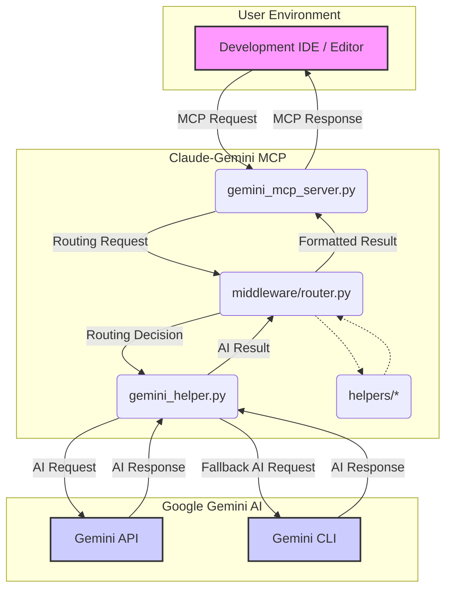

# Claude-Gemini MCP: The Definitive Guide (v3.1)


## 1. Introduction

Welcome to the Claude-Gemini Multi-Context Platform (MCP), a sophisticated integration that supercharges your development environment by bridging the gap between your IDE and the powerful Gemini family of AI models. This system is more than just a simple API wrapper; it's an intelligent, context-aware orchestration engine designed to provide you with the most relevant, accurate, and timely AI assistance possible.

This document serves as the complete reference manual for the MCP. Whether you're a developer using the MCP, a contributor extending its capabilities, or an administrator deploying it, this guide will provide you with a thorough understanding of its architecture, features, and usage.

### 1.1. What is the Claude-Gemini MCP?

The Claude-Gemini MCP is a server that acts as an intelligent intermediary between your development environment (like VS Code with the Claude extension) and Google's Gemini AI models. It intercepts requests from your IDE, enriches them with relevant context, and routes them to the most appropriate AI model for the task at hand.

### 1.2. Key Features

*   **Intelligent Middleware Routing**: A sophisticated, middleware-based routing engine that dynamically selects the best AI model based on the task, context size, and desired performance.
*   **Decoupled Architecture**: A clean, maintainable architecture that separates concerns into distinct layers: server, AI interaction, and helper utilities.
*   **Structured Data with Pydantic and Instructor**: Leverages `pydantic` for robust data validation and `instructor` to get structured, predictable JSON objects from the AI.
*   **Comprehensive Code Analysis**: In-depth analysis of single files (`analyze_code`) or entire codebases (`codebase_analysis`) for security, performance, and architectural insights.
*   **Advanced Security**: Built-in security features, including input sanitization and path validation, to protect against prompt injection and other vulnerabilities.
*   **Decoupled Configuration**: A flexible configuration system that allows you to customize every aspect of the MCP's behavior.
*   **Slash Commands**: A rich set of over 20 slash commands for quick and easy access to the MCP's features.

## 2. Architecture

The MCP is built on a decoupled, modular architecture that promotes maintainability, scalability, and security.



### 2.1. Core Components

*   **`gemini_mcp_server.py` (The Communicator)**: This is the main entry point for all requests from the IDE. Its sole responsibility is to handle MCP requests and responses, and to orchestrate the workflow by calling other modules. It **does not** contain any direct AI API call logic.

*   **`gemini_helper.py` (The AI Specialist)**: This module is responsible for all interactions with the backend AI providers, whether it's through the Gemini API, the Gemini CLI, or the OpenRouter API. It uses the `execution_orchestrator` to intelligently decide which method to use.

*   **`middleware/router.py` (The Brain)**: This is the heart of the MCP's intelligence. The router analyzes each incoming request and decides which AI model and provider to use based on a set of configurable rules. This allows the MCP to use fast, cheap models for simple tasks, and more powerful, expensive models for complex ones. It can route requests to Google Gemini, or to a variety of other models via OpenRouter, including Kimi K2, Qwen 3, DeepSeek, and GLM 4.5.

*   **`helpers/` (The Toolbox)**: This directory contains a collection of specialized modules that provide pre-processing and post-processing capabilities. This includes tools for code analysis, security, and data transformation.

### 2.2. The Decoupled Module Pattern

The MCP's architecture is designed to be as decoupled as possible. This means that each component has a single, well-defined responsibility and can be modified or replaced without affecting other parts of the system. This makes the codebase easier to understand, maintain, and extend.

## 3. Core Technologies

The MCP leverages a number of powerful, modern technologies to provide its advanced features.

*   **Pydantic**: We use `pydantic` for data validation and settings management. This ensures that all data flowing through the system is well-structured and type-safe, which helps to prevent bugs and makes the code easier to reason about.

*   **Instructor**: `instructor` is a library that makes it easy to get structured, predictable JSON objects from language models. We use it to power our Agentic Collaboration Protocol (ACP), which allows us to treat the AI as a true collaborator that can provide structured data, not just plain text.

*   **Middleware Routing Engine**: The new middleware-based routing engine is the core of the MCP's intelligence. It allows us to define complex routing rules that can take into account a wide range of factors, including the content of the request, the size of the context, and the desired performance characteristics.

## 4. Features in Detail

### 4.1. The Middleware-Powered Routing Engine

The MCP's routing engine is designed to be both powerful and flexible. It supports a number of different routing strategies, which can be combined to create sophisticated routing logic.

At the core of the MCP's intelligence is its ability to leverage multiple AI providers, including Google Gemini and OpenRouter. This allows the MCP to select the best model for a given task from a wide range of options, optimizing for performance, cost, and quality.

*   **Multi-Provider Support**: The MCP is not limited to a single AI provider. It can be configured to use any number of providers, including Google Gemini and OpenRouter. This allows you to take advantage of the unique strengths of each provider and to create a truly customized AI experience.

*   **Configurable Routing Strategies**: The router's behavior is determined by a set of configurable routing strategies. You can choose from a variety of strategies, including:
    *   **Scenario-Based Routing**: This strategy routes requests based on a set of predefined scenarios, such as "default", "background", "think", "longContext", and "webSearch". This allows you to use different models for different types of tasks.
    *   **Token-Aware Routing**: This strategy selects the best model for a given task based on the size of the context. This ensures that you're always using the most cost-effective model that can handle the request.
    *   **Cost-Optimized Routing**: This strategy prioritizes cost, choosing the most economical model that meets the quality requirements of the task.
    *   **Performance-Optimized Routing**: This strategy prioritizes performance, choosing the fastest available model.

*   **Fallback Strategies**: The router supports a number of different fallback strategies, which determine what to do when a request to a model fails. This includes cascading fallbacks, where the router will try a series of different models in order, and CLI fallbacks, where the router will fall back to using the Gemini CLI if the API is unavailable.

### 4.2. Tool Orchestration

The `execution_orchestrator.py` module is responsible for intelligently deciding how to execute a given request. It can choose between using the Gemini API directly, or using the Gemini CLI. This allows the MCP to be resilient to API outages and to take advantage of the unique capabilities of the CLI.

### 4.3. Code Analysis

The MCP provides two powerful tools for code analysis:

*   **`analyze_code`**: This tool can be used to perform a deep analysis of a single code file. It can provide insights into security, performance, and architecture.

*   **`codebase_analysis`**: This tool can be used to analyze an entire codebase. It uses Gemini's massive context window to provide a holistic view of the project's architecture, dependencies, and overall health.

### 4.4. Structured Data (Agentic Collaboration Protocol)

The MCP uses `pydantic` and `instructor` to get structured JSON objects from the AI. This is a key part of our Agentic Collaboration Protocol (ACP), which allows us to treat the AI as a true collaborator that can provide structured data, not just plain text. This is a powerful feature that enables a wide range of advanced use cases.

### 4.5. Security

The MCP includes a number of security features to protect against common vulnerabilities.

*   **Input Sanitization**: All user inputs are sanitized to prevent prompt injection and other attacks.

*   **Path Validation**: All file paths are validated to ensure that they are within the project's root directory. This prevents the AI from accessing sensitive files outside of the project.

### 4.6. Configuration

The MCP's configuration system is designed to be both powerful and flexible. It allows you to customize every aspect of the MCP's behavior, from the models it uses to the timeouts for API requests. The configuration is managed through a central `config.py` module, which ensures that all settings are in one place and easy to manage.

### 4.8. Deterministic Tool Logic: The Key to Reliable AI

A core principle of the Claude-Gemini MCP is that its tools are not simply prompts sent to an AI. Each tool is backed by a dedicated, deterministic Python module that performs a significant amount of pre-processing and analysis *before* the AI is ever called. This is the key to the MCP's reliability and the reason it doesn't hallucinate.

Take, for example, the `analyze_code` and `codebase_analysis` tools. When you invoke one of these tools, you're not just asking the AI to "analyze this code." Instead, you're triggering a sophisticated pipeline of analysis that includes:

1.  **Abstract Syntax Tree (AST) Parsing**: The code is first parsed into an AST, which is a tree representation of the code's structure. This allows us to analyze the code in a structured, programmatic way.

2.  **Strategic Analysis**: We then apply a series of analysis strategies to the AST, each designed to look for specific types of issues. This includes strategies for security, performance, quality, and architectural analysis.

3.  **Metric Calculation**: We calculate a wide range of metrics about the code, including cyclomatic complexity, cognitive complexity, and maintainability index.

4.  **AI-Powered Interpretation**: Only after all of this analysis has been performed do we call the AI. The AI is not asked to analyze the code from scratch; instead, it is given the results of our pre-analysis and asked to interpret and summarize them in a human-readable format.

This approach has a number of significant advantages:

*   **Reliability**: Because the analysis is performed by deterministic code, the results are reliable and repeatable. You can be confident that the MCP is not just making things up.

*   **Accuracy**: By grounding the AI's analysis in the results of our pre-analysis, we can ensure that its conclusions are accurate and relevant.

*   **Performance**: By performing the bulk of the analysis in dedicated Python modules, we can take advantage of the performance of compiled code and avoid the overhead of calling the AI for every little thing.

This is the secret sauce of the Claude-Gemini MCP. It's not just a thin wrapper around an AI; it's a sophisticated analysis engine that uses the AI as a powerful tool for interpretation and summarization.

### 4.9. A Deep Dive into the Analysis Tools

To give you a better understanding of how this works in practice, let's take a closer look at the deterministic logic within the `analyze_code` and `codebase_analysis` tools.

#### `analyze_code.py`: The Single-File Specialist

This module is responsible for performing a deep, focused analysis of a single code file or snippet. It uses a Strategy Pattern with an AST Visitor implementation to perform a variety of analyses.

*   **AST Parsing**: The code is first parsed into an AST. If the code is not valid Python, this step will fail and the tool will return an error.

*   **Security Analysis**: The `SecurityAnalysisStrategy` looks for a variety of common security vulnerabilities, including:
    *   Use of dangerous functions like `eval` and `exec`.
    *   Import of potentially dangerous modules like `subprocess` and `pickle`.
    *   Hardcoded secrets like passwords and API keys.
    *   Potential SQL injection and command injection vulnerabilities.

*   **Quality Analysis**: The `QualityAnalysisStrategy` assesses the quality of the code based on a number of factors, including:
    *   Adherence to PEP 8 naming conventions.
    *   Presence of docstrings for functions and classes.
    *   Cyclomatic complexity of functions.

*   **Performance Analysis**: The `PerformanceAnalysisStrategy` looks for common performance issues, such as:
    *   Inefficient algorithm patterns, like nested loops.
    *   Repeated string concatenation in loops.

#### `codebase_analyzer.py`: The Project-Wide Orchestrator

This module is responsible for analyzing an entire codebase. It uses a pipeline pattern with parallel execution to perform a comprehensive analysis of the project.

*   **File Discovery**: The `FileDiscoverer` recursively scans the project directory, filtering out irrelevant files and directories based on a configurable set of rules.

*   **Content Aggregation**: The `ContentAggregator` reads the content of the discovered files and aggregates them into a single payload. It also intelligently truncates large files to ensure that the payload does not exceed the AI's context window.

*   **Project Structure Analysis**: The `ProjectStructureAnalyzer` analyzes the structure of the project, including:
    *   The distribution of languages and file extensions.
    *   The directory structure.
    *   The Python package structure, including potential circular imports and missing `__init__.py` files.

*   **Tech Stack Detection**: The `TechStackDetector` analyzes the project's files to detect the technologies it uses, including:
    *   Frameworks (e.g., Django, Flask, React, Vue).
    *   Databases (e.g., PostgreSQL, MySQL, MongoDB).
    *   Testing frameworks (e.g., pytest, Jest).
    *   Build tools (e.g., Make, Webpack, Vite).
    *   Deployment tools (e.g., Docker, Jenkins, GitHub Actions).

Only after all of this analysis has been performed is the AI called to interpret the results. This ensures that the AI's analysis is grounded in a deep, accurate understanding of the codebase.


### 4.11. Core Agentic Models: The Smart Processing Pipeline

The Claude-Gemini MCP is more than just a collection of tools; it's an agentic system that uses a smart processing pipeline to deliver high-quality, reliable results. This pipeline is built around a set of core agentic models, which are defined in `src/claude_gemini_mcp/helpers/agentric_models.py`.

#### The Smart Processing Pipeline

When you invoke a tool, the MCP doesn't just send your request to the AI. Instead, it uses a smart processing pipeline to enrich your request with relevant context and to ensure that the AI's response is structured and reliable.

1.  **Deterministic Pre-Analysis**: As we've discussed, the MCP first performs a deterministic analysis of your code. This provides a reliable, ground-truth understanding of your code that we can use to guide the AI.

2.  **Structured Prompting with `instructor`**: We then use the `instructor` library to create a structured prompt that includes the results of our pre-analysis. This prompt is designed to elicit a structured response from the AI in the form of a Pydantic model.

3.  **AI-Powered Interpretation**: The AI then processes the structured prompt and returns a structured response in the form of a JSON object that conforms to one of our Pydantic models.

4.  **Pydantic Validation**: We then use `pydantic` to validate the AI's response. This ensures that the response is well-formed and that it contains all of the information we expect.

5.  **Structured Output**: Finally, we return the validated, structured response to you. This allows you to work with the AI's response in a programmatic way, rather than having to parse it from plain text.

#### `AgenticCodePatch`: The Future of AI-Powered Refactoring

The `AgenticCodePatch` is a Pydantic model that represents a structured, AI-generated code patch. It's the cornerstone of our vision for the future of AI-powered refactoring, and it's a great example of the power of the smart processing pipeline.

When you ask the MCP to refactor your code, it doesn't just return a block of text. Instead, it returns an `AgenticCodePatch` object that contains:

*   **A list of atomic code modification steps**: Each step includes a description of the change, a unified diff of the change, and the line range of the change.

*   **A test strategy**: This includes the type of testing required, a list of test files that should be created or modified, and a list of commands to run to test the changes.

*   **Security considerations**: This includes the security risk level of the changes, a list of security considerations that were addressed, and a list of security mitigations that were implemented.

This structured approach to code modification has a number of significant advantages:

*   **Traceability**: Because each change is represented as an atomic step, it's easy to trace the history of a file and to understand why each change was made.

*   **Validation**: Because the `AgenticCodePatch` is a Pydantic model, we can validate it to ensure that it is well-formed and that it contains all of the information we expect. This helps to prevent bugs and to ensure that the AI is not making mistakes.

*   **Automation**: Because the `AgenticCodePatch` is a structured object, we can use it to automate the process of applying code changes. This is a key part of our vision for the future of AI-powered development.

By using the `AgenticCodePatch` and the smart processing pipeline, we can transform the AI from a simple code generator into a true collaborator that can help us to write better, more reliable code.

## 5. Getting Started

This section provides a comprehensive guide to getting the Claude-Gemini MCP up and running on your system. We provide an automated installation script for a streamlined setup, as well as manual instructions for those who prefer a more hands-on approach.

### 5.1. Automated Installation (Recommended)

The easiest way to get started is to use the automated installation script. This script will detect your operating system and install all the necessary dependencies for you.

1.  **Download the script**:
    ```bash
    curl -o installation.sh https://raw.githubusercontent.com/your-username/claude-gemini-mcp-slim/main/installation.sh
    ```

2.  **Make the script executable**:
    ```bash
    chmod +x installation.sh
    ```

3.  **Run the script**:
    ```bash
    ./installation.sh
    ```

The script will guide you through the installation process. It will:

*   Check for the required dependencies (like `uv` and Python).
*   Create a shared virtual environment for all your MCP servers.
*   Install all the necessary Python packages.
*   Provide you with an activation script to easily activate the environment.

### 5.2. Manual Installation

If you prefer to install the MCP manually, you can follow these steps.

#### 5.2.1. Prerequisites

*   **Python 3.10+**: You can check your Python version by running `python3 --version`.
*   **`uv`**: `uv` is a fast, modern package installer for Python. You can install it by running:
    ```bash
    curl -LsSf https://astral.sh/uv/install.sh | sh
    ```

#### 5.2.2. Installation Steps

1.  **Clone the repository**:
    ```bash
    git clone https://github.com/your-username/claude-gemini-mcp-slim.git
    cd claude-gemini-mcp-slim
    ```

2.  **Create a virtual environment**:
    ```bash
    uv venv
    ```

3.  **Activate the virtual environment**:
    *   **macOS / Linux**:
        ```bash
        source .venv/bin/activate
        ```
    *   **Windows (Git Bash)**:
        ```bash
        source .venv/Scripts/activate
        ```

4.  **Install the dependencies**:
    ```bash
    uv sync --dev
    ```

### 5.3. Development Setup

If you want to contribute to the development of the MCP, you can use the `setup-dev.sh` script to set up your development environment.

1.  **Run the script**:
    ```bash
    ./scripts/setup-dev.sh
    ```

This script will:

*   Install all the development dependencies.
*   Set up the pre-commit hooks with Husky.

### 5.4. Code Formatting

We use `black`, `isort`, and `flake8` to format our code. To ensure that your code is properly formatted before you commit, you can use the `format_code.sh` script.

1.  **Run the script**:
    ```bash
    ./scripts/format_code.sh
    ```

This will run all the necessary formatters and linters to ensure that your code is clean and consistent.

### 5.5. Uninstallation

If you need to uninstall the MCP, you can do so by following these steps:

1.  **Remove the shared MCP directory**:
    ```bash
    rm -rf ~/mcp-servers
    ```

2.  **Remove the project directory**:
    ```bash
    rm -rf /path/to/your/claude-gemini-mcp-slim
    ```

3.  **Remove the `uv` cache** (optional):
    ```bash
    uv cache clean
    ```

This will completely remove the MCP and all of its dependencies from your system.

## 6. MCP JSON Configuration

To use the Claude-Gemini MCP, you need to add it to your MCP configuration file. The configuration file is typically located at:

*   **macOS**: `~/Library/Application Support/Claude/claude_desktop_config.json`
*   **Windows**: `%APPDATA%\Claude\claude_desktop_config.json`
*   **Linux**: `~/.config/claude/claude_desktop_config.json`

### 6.1. Basic Configuration

Here's a basic configuration to get you started:

```json
{
  "mcpServers": {
    "claude-gemini-mcp": {
      "command": "uv",
      "args": ["run", "claude-gemini-mcp"],
      "env": {
        "GEMINI_API_KEY": "your-gemini-api-key-here"
      }
    }
  }
}
```

### 6.2. Advanced Configuration with Intelligent Routing

For the full power of intelligent routing with access to multiple AI models, use this advanced configuration:

```json
{
  "mcpServers": {
    "claude-gemini-mcp": {
      "command": "uv",
      "args": ["run", "claude-gemini-mcp"],
      "env": {
        "GEMINI_API_KEY": "your-gemini-api-key-here",
        "OPENROUTER_API_KEY": "your-openrouter-api-key-here",
        
        "ENABLE_ROUTING": "true",
        "ENABLE_OPENROUTER": "true",
        
        "OPENROUTER_DEFAULT_MODEL": "openrouter,openai/gpt-4o-mini",
        "OPENROUTER_BACKGROUND_MODEL": "openrouter,openai/gpt-4o-mini",
        "OPENROUTER_THINK_MODEL": "openrouter,anthropic/claude-3.5-sonnet",
        "OPENROUTER_LONGCONTEXT_MODEL": "openrouter,moonshot/moonshot-kimi-k2-instruct",
        "OPENROUTER_WEBSEARCH_MODEL": "openrouter,perplexity/llama-3.1-sonar-large-128k-online",
        "OPENROUTER_CODING_MODEL": "openrouter,qwen/qwen3-coder-30b-instruct",
        "OPENROUTER_ANALYSIS_MODEL": "openrouter,zai/glm-4.5",
        "OPENROUTER_MULTIMODAL_MODEL": "openrouter,openai/gpt-4o",
        "OPENROUTER_REASONING_MODEL": "openrouter,deepseek/deepseek-r1-0528"
      }
    }
  }
}
```

#### Understanding the Routing Scenarios

Each scenario corresponds to a different type of task that the MCP automatically detects:

- **`DEFAULT`**: General-purpose queries and standard tasks
- **`BACKGROUND`**: Simple, quick tasks like basic questions or documentation lookups
- **`THINK`**: Complex reasoning, problem-solving, and analytical tasks
- **`LONGCONTEXT`**: Large documents, extensive codebases (>60K tokens)
- **`WEBSEARCH`**: Tasks involving current events or real-time information
- **`CODING`**: Programming, code generation, and technical implementation
- **`ANALYSIS`**: Data analysis, detailed evaluation, and comprehensive reviews
- **`MULTIMODAL`**: Image processing, vision tasks, and multimedia content
- **`REASONING`**: Advanced logical reasoning and step-by-step problem solving

### 6.3. Model Selection Guide: Pick Your Perfect Team

With thousands of models available through OpenRouter, choosing the right ones can seem overwhelming. Here's our curated selection guide:

#### **For Speed & Cost Efficiency:**
```json
"OPENROUTER_DEFAULT_MODEL": "openrouter,openai/gpt-4o-mini",
"OPENROUTER_BACKGROUND_MODEL": "openrouter,openai/gpt-4o-mini"
```

#### **For Advanced Reasoning:**
```json
"OPENROUTER_THINK_MODEL": "openrouter,anthropic/claude-3.5-sonnet",
"OPENROUTER_REASONING_MODEL": "openrouter,deepseek/deepseek-r1-0528"
```

#### **For Programming Excellence:**
```json
"OPENROUTER_CODING_MODEL": "openrouter,qwen/qwen3-coder-30b-instruct"
```
*Alternative: `qwen/qwen3-coder-480b-a35b-instruct` for the most advanced coding capabilities*

#### **For Long Documents:**
```json
"OPENROUTER_LONGCONTEXT_MODEL": "openrouter,moonshot/moonshot-kimi-k2-instruct"
```
*200K context window, perfect for large codebases and documents*

#### **For Analysis & Evaluation:**
```json
"OPENROUTER_ANALYSIS_MODEL": "openrouter,zai/glm-4.5"
```
*State-of-the-art model competitive with Claude and GPT-4*

#### **For Multimodal Tasks:**
```json
"OPENROUTER_MULTIMODAL_MODEL": "openrouter,openai/gpt-4o"
```
*Excellent vision capabilities for image analysis and processing*

### 6.4. How the Magic Happens: Automatic Routing in Action

When you send a request to the MCP, here's what happens behind the scenes:

```
User Request: "Analyze this complex algorithm and suggest performance optimizations"
    ↓
Router Analysis:
  • Content Analysis: Detects keywords "analyze", "complex", "optimizations"
  • Complexity Score: 8/10 (high complexity)
  • Context Size: ~15K tokens
  • Content Type: Code analysis
    ↓
Scenario Detection: "analysis" (high complexity analytical task)
    ↓
Model Selection: Uses OPENROUTER_ANALYSIS_MODEL → "zai/glm-4.5"
    ↓
Execution: Request routed to GLM-4.5 via OpenRouter
    ↓
Response: High-quality analysis with optimization suggestions
```

The beauty is that this all happens automatically. You don't need to think about which model to use – the MCP's intelligent routing engine handles it for you.

### 6.5. Advanced Configuration: Fine-Tuning Your Experience

For power users who want even more control, the MCP offers advanced configuration options:

```json
{
  "mcpServers": {
    "claude-gemini-mcp": {
      "command": "uv",
      "args": ["run", "claude-gemini-mcp"],
      "env": {
        "GEMINI_API_KEY": "your-gemini-api-key-here",
        "OPENROUTER_API_KEY": "your-openrouter-api-key-here",
        
        "ENABLE_ROUTING": "true",
        "ENABLE_OPENROUTER": "true",
        "ENABLE_PERFORMANCE_MONITORING": "true",
        "ENABLE_COST_TRACKING": "true",
        "ENABLE_TELEMETRY": "true",
        
        "OPENROUTER_DEFAULT_MODEL": "openrouter,openai/gpt-4o-mini",
        "OPENROUTER_BACKGROUND_MODEL": "openrouter,openai/gpt-4o-mini",
        "OPENROUTER_THINK_MODEL": "openrouter,anthropic/claude-3.5-sonnet",
        "OPENROUTER_LONGCONTEXT_MODEL": "openrouter,moonshot/moonshot-kimi-k2-instruct",
        "OPENROUTER_WEBSEARCH_MODEL": "openrouter,perplexity/llama-3.1-sonar-large-128k-online",
        "OPENROUTER_CODING_MODEL": "openrouter,qwen/qwen3-coder-30b-instruct",
        "OPENROUTER_ANALYSIS_MODEL": "openrouter,zai/glm-4.5",
        "OPENROUTER_MULTIMODAL_MODEL": "openrouter,openai/gpt-4o",
        "OPENROUTER_REASONING_MODEL": "openrouter,deepseek/deepseek-r1-0528",
        
        "CLI_TIMEOUT": "120",
        "API_TIMEOUT": "60",
        "MAX_CONTEXT_WINDOW": "2000000",
        "ENABLE_SANITIZATION": "true",
        "ENABLE_MARKDOWN_CONVERSION": "true"
      }
    }
  }
}
```

#### Configuration Options Explained:

**Routing Features:**
- `ENABLE_ROUTING`: Activates the intelligent routing engine
- `ENABLE_OPENROUTER`: Enables access to thousands of additional models
- `ENABLE_PERFORMANCE_MONITORING`: Tracks response times and success rates
- `ENABLE_COST_TRACKING`: Monitors usage costs across different models
- `ENABLE_TELEMETRY`: Collects analytics for routing optimization

**Model Selection:**
- Each `OPENROUTER_*_MODEL` variable follows the format: `"openrouter,model-id"`
- You can find thousands of model IDs at [OpenRouter.ai/models](https://openrouter.ai/models)
- Mix and match any combination of models for different scenarios

**Performance Tuning:**
- `CLI_TIMEOUT`: Timeout for CLI operations (seconds)
- `API_TIMEOUT`: Timeout for API calls (seconds)
- `MAX_CONTEXT_WINDOW`: Maximum context size to process

**Security & Processing:**
- `ENABLE_SANITIZATION`: Input sanitization and security validation
- `ENABLE_MARKDOWN_CONVERSION`: Automatic markdown formatting for responses

### 6.6. Getting Your API Keys

To use the advanced routing features, you'll need API keys:

1. **Gemini API Key**: Get yours at [Google AI Studio](https://makersuite.google.com/app/apikey)
2. **OpenRouter API Key**: Sign up at [OpenRouter.ai](https://openrouter.ai/) for access to 100+ models

Both services offer generous free tiers to get you started.

### 6.7. Monitoring Your AI Team

With telemetry enabled, you can monitor how your AI team is performing:

- **Response Times**: Which models are fastest for different tasks
- **Success Rates**: Model reliability and error rates
- **Cost Tracking**: Usage costs across different models
- **Routing Decisions**: Which scenarios trigger which models

This data helps you optimize your configuration over time, ensuring you get the best performance at the lowest cost.

The Claude-Gemini MCP isn't just another AI integration – it's your personal AI orchestration platform, intelligently managing a team of specialized models to give you the best possible assistance for every task.

## 7. Usage Examples

### 7.1. Quick Query

To ask a quick question, you can use the `gemini_quick_query` tool:

```
/mcp__gemini-mcp__gemini_quick_query "How do I implement a binary search in Python?"
```

Or, using the slash command:

```
/g How do I implement a binary search in Python?
```

### 7.2. Code Analysis

To analyze a file, you can use the `gemini_analyze_code` tool:

```
/mcp__gemini-mcp__gemini_analyze_code "your code here" security
```

Or, using the slash command:

```
/analyze "your code here" security
```

### 7.3. Codebase Analysis

To analyze an entire codebase, you can use the `gemini_codebase_analysis` tool:

```
/mcp__gemini-mcp__gemini_codebase_analysis "./src" all
```

Or, using the slash command:

```
/c ./src all
```

## 8. Contributing

Contributions are welcome! Please see the [contributing guidelines](CONTRIBUTING.md) for more information.

## 9. License

This project is licensed under the MIT License. See the [LICENSE.md](LICENSE.md) file for details.
